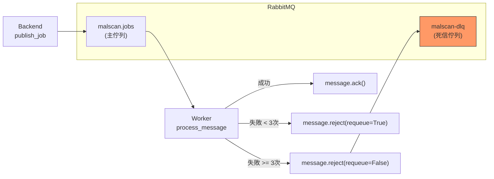

# 技術設計文件

## 概述

本變更引入 **Tenacity** 套件來統一管理 Backend 和 Worker 的重試邏輯，取代現有的手寫 `for` 迴圈實作。

## 設計決策

### 1. 選擇 Tenacity 而非其他方案

| 方案 | 優點 | 缺點 |
|------|------|------|
| **Tenacity** | 宣告式語法、功能完整、活躍維護 | 新增依賴 |
| 手寫重試 | 無新依賴 | 程式碼重複、難以維護 |
| backoff 套件 | 簡單 | 功能較少，不支援 async 原生 |

**結論**: Tenacity 提供最佳的開發體驗與功能完整性。

### 2. 重試策略參數

```
Backend publish_job:
├── stop_after_attempt(5)      # 最多 5 次嘗試
├── wait_exponential(1, 16)    # 1s → 2s → 4s → 8s → 16s
└── 總最大等待時間: 31 秒

Worker connect_with_retry:
├── stop_after_attempt(90)     # 保持原有的 90 次嘗試
├── wait_fixed(10)             # 固定 10 秒間隔 (啟動階段)
└── 總最大等待時間: 15 分鐘

Worker download_file:
├── stop_after_attempt(3)      # 最多 3 次嘗試
├── wait_exponential(1, 8)     # 1s → 2s → 4s
└── 總最大等待時間: 7 秒
```

### 3. Dead Letter Queue 架構



**DLQ 訊息處理策略:**
- 訊息進入 DLQ 後不會自動處理
- 運維人員可透過 RabbitMQ Management UI 檢視失敗訊息
- 未來可實作 DLQ 消費者進行告警或自動重試

### 4. 重試次數追蹤

RabbitMQ 在訊息被 reject 並重新投遞時，會在 header 中加入 `x-death` 陣列，記錄死信歷史。我們透過解析這個 header 來判斷訊息的重試次數：

```python
def _get_retry_count(message: aio_pika.abc.AbstractIncomingMessage) -> int:
    """Extract retry count from message x-death header."""
    x_death = message.headers.get("x-death", [])
    if not x_death:
        return 0
    # x-death 是一個列表，每個元素代表一次死信事件
    # count 欄位表示該事件發生的次數
    return sum(entry.get("count", 0) for entry in x_death)
```

## 影響範圍

### 檔案變更

| 檔案 | 變更類型 | 說明 |
|------|----------|------|
| `backend/pyproject.toml` | MODIFY | 新增 tenacity 依賴 |
| `worker/pyproject.toml` | MODIFY | 新增 tenacity 依賴 |
| `backend/src/malscan/queue.py` | MODIFY | 使用 @retry 裝飾器 |
| `worker/src/malscan_worker/storage.py` | MODIFY | 新增下載重試 |
| `worker/src/malscan_worker/consumer.py` | MODIFY | DLQ 設定、訊息重試 |

### 向後相容性

- **完全向後相容**: 外部 API 和訊息格式沒有變化
- **佇列參數變更**: 主佇列新增 `x-dead-letter-*` 參數
  - ⚠️ RabbitMQ 不允許修改已存在佇列的參數
  - 解決方案: 若佇列已存在，忽略參數設定錯誤 (佇列仍可正常運作)

## 錯誤處理流程

### Backend publish_job 失敗

```
嘗試 1 失敗 → 等待 1s
嘗試 2 失敗 → 等待 2s
嘗試 3 失敗 → 等待 4s
嘗試 4 失敗 → 等待 8s
嘗試 5 失敗 → 拋出例外，回傳 HTTP 500
```

### Worker 訊息處理失敗

```
嘗試 1 失敗 → reject(requeue=True) → 重新投遞
嘗試 2 失敗 → reject(requeue=True) → 重新投遞
嘗試 3 失敗 → reject(requeue=False) → 進入 DLQ
```
